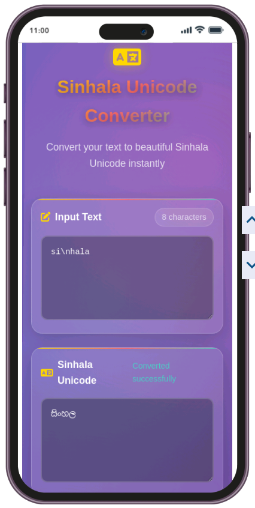

# 🌟 Enhanced Sinhala Unicode Converter

A modern, feature-rich web application for converting text to Sinhala Unicode with a beautiful glassmorphism UI and advanced functionality.


## ✨ Features

### 🎨 **Modern UI/UX**
- **Glassmorphism Design**: Beautiful translucent interface with backdrop blur effects
- **Animated Background**: Dynamic gradient animations for visual appeal
- **Responsive Layout**: Works perfectly on desktop, tablet, and mobile devices
- **Dark Theme**: Elegant dark interface with proper contrast ratios
- **Smooth Animations**: Micro-interactions and hover effects throughout

### ⚡ **Advanced Functionality**
- **Real-time Conversion**: Auto-convert as you type (toggleable)
- **Smart Debouncing**: Prevents API spam with intelligent delays
- **Character Counter**: Live character count with visual warnings
- **Copy to Clipboard**: One-click copying with visual feedback
- **Paste Support**: Easy paste from clipboard functionality
- **Loading States**: Clear visual indicators during conversion
- **Error Handling**: User-friendly error messages with retry options

### ⌨️ **Keyboard Shortcuts**
- `Ctrl + Enter`: Convert text instantly
- `Ctrl + K`: Clear input field
- `Ctrl + D`: Toggle auto-convert mode
- `Escape`: Hide notifications

### 🔧 **Technical Features**
- **Debounced API Calls**: Optimized performance with smart request handling
- **Request Timeout**: 10-second timeout protection
- **Local Storage**: Saves user preferences
- **Service Worker Ready**: PWA capabilities prepared
- **Accessibility**: ARIA labels and keyboard navigation support
- **Performance Monitoring**: Built-in performance tracking

## 🚀 Demo

[**🔗 Live Demo**](https://your-username.github.io/sinhala-unicode-converter) *(Replace with your actual GitHub Pages URL)*

## 📸 Screenshots

### Desktop View


### Mobile View


## 🛠️ Installation & Usage

### Quick Start
1. **Clone the repository**
   ```bash
   git clone https://github.com/your-username/sinhala-unicode-converter.git
   cd sinhala-unicode-converter
   ```

2. **Open in browser**
   ```bash
   # Simply open index.html in your web browser
   open index.html  # macOS
   start index.html # Windows
   xdg-open index.html # Linux
   ```

### Local Development Server
For development with live reload:

```bash
# Using Python (if installed)
python -m http.server 8000

# Using Node.js live-server (if installed)
npx live-server

# Using PHP (if installed)
php -S localhost:8000
```

Then visit `http://localhost:8000`

## 📁 Project Structure

```
sinhala-unicode-converter/
├── 📄 index.html          # Main HTML file
├── 🎨 styles.css          # Enhanced CSS with animations
├── ⚡ script.js           # Advanced JavaScript functionality
├── 📖 README.md           # Project documentation
├── 📷 screenshots/        # Application screenshots
│   ├── desktop.png
│   └── mobile.png
└── 🔧 sw.js              # Service Worker (optional)
```

## 🎯 How to Use

1. **Enter Text**: Type or paste your text in the input field
2. **Auto-Convert**: Enable auto-convert for real-time conversion as you type
3. **Manual Convert**: Click "Convert Now" button or use `Ctrl+Enter`
4. **Copy Result**: Click the copy button or use the keyboard shortcut
5. **Clear Input**: Use the clear button or `Ctrl+K` to reset

### Input Examples
- `si\nhala` → `සිංහල`
- `ayubowan` → `ආයුබෝවන්`
- `kohomada` → `කොහොමද`

## 🔌 API Integration

This application uses the **Easy Sinhala Unicode API**:
- **Endpoint**: `https://easysinhalaunicode.com/Api/convert`
- **Method**: POST
- **Data**: `{ data: "text_to_convert" }`
- **Timeout**: 10 seconds
- **Error Handling**: Comprehensive error management with user feedback

## 🎨 Customization

### Color Scheme
Modify the CSS custom properties in `styles.css`:

```css
:root {
  --primary-gradient: linear-gradient(135deg, #667eea 0%, #764ba2 100%);
  --accent-color: #ffd700;
  --success-color: #4ecdc4;
  --error-color: #ff6b6b;
  --warning-color: #ffd700;
}
```

### Animation Settings
Adjust animation durations and easing:

```css
:root {
  --animation-duration: 0.3s;
  --animation-easing: ease-out;
  --debounce-delay: 500ms;
}
```

## 🌐 Browser Support

| Browser | Version | Status |
|---------|---------|--------|
| Chrome  | 90+     | ✅ Full Support |
| Firefox | 88+     | ✅ Full Support |
| Safari  | 14+     | ✅ Full Support |
| Edge    | 90+     | ✅ Full Support |
| Opera   | 76+     | ✅ Full Support |

### Required Browser Features
- CSS Grid & Flexbox
- CSS Backdrop Filter
- Fetch API or jQuery AJAX
- Local Storage
- Clipboard API (optional)

## 🚀 Deployment

### GitHub Pages
1. Push your code to GitHub
2. Go to repository Settings → Pages
3. Select source branch (usually `main`)
4. Your site will be available at `https://your-username.github.io/repository-name`

### Netlify
1. Connect your GitHub repository
2. Build settings: None required (static site)
3. Deploy automatically on push

### Vercel
1. Import your GitHub repository
2. Framework preset: Other
3. Deploy with zero configuration

## 🤝 Contributing

Contributions are welcome! Please feel free to submit a Pull Request.

### Development Guidelines
1. **Fork** the repository
2. **Create** a feature branch (`git checkout -b feature/AmazingFeature`)
3. **Commit** your changes (`git commit -m 'Add some AmazingFeature'`)
4. **Push** to the branch (`git push origin feature/AmazingFeature`)
5. **Open** a Pull Request

### Code Style
- Use meaningful variable names
- Add comments for complex logic
- Follow existing code formatting
- Test on multiple browsers
- Ensure responsive design

## 🐛 Bug Reports & Feature Requests

Found a bug or have a feature request? Please [open an issue](https://github.com/your-username/sinhala-unicode-converter/issues) with:

**For Bugs:**
- Browser and version
- Steps to reproduce
- Expected vs actual behavior
- Screenshots if applicable

**For Features:**
- Clear description of the feature
- Use case examples
- Implementation suggestions (optional)

## 📄 License

This project is licensed under the MIT License - see the [LICENSE](LICENSE) file for details.

```
MIT License

Copyright (c) 2024 Your Name

Permission is hereby granted, free of charge, to any person obtaining a copy
of this software and associated documentation files (the "Software"), to deal
in the Software without restriction, including without limitation the rights
to use, copy, modify, merge, publish, distribute, sublicense, and/or sell
copies of the Software, and to permit persons to whom the Software is
furnished to do so, subject to the following conditions:

The above copyright notice and this permission notice shall be included in all
copies or substantial portions of the Software.

THE SOFTWARE IS PROVIDED "AS IS", WITHOUT WARRANTY OF ANY KIND, EXPRESS OR
IMPLIED, INCLUDING BUT NOT LIMITED TO THE WARRANTIES OF MERCHANTABILITY,
FITNESS FOR A PARTICULAR PURPOSE AND NONINFRINGEMENT. IN NO EVENT SHALL THE
AUTHORS OR COPYRIGHT HOLDERS BE LIABLE FOR ANY CLAIM, DAMAGES OR OTHER
LIABILITY, WHETHER IN AN ACTION OF CONTRACT, TORT OR OTHERWISE, ARISING FROM,
OUT OF OR IN CONNECTION WITH THE SOFTWARE OR THE USE OR OTHER DEALINGS IN THE
SOFTWARE.
```

## 🙏 Acknowledgments

- **Easy Sinhala Unicode API** for providing the conversion service
- **Font Awesome** for beautiful icons
- **jQuery** for simplified AJAX requests
- **Google Fonts** for typography
- **CSS Glassmorphism** community for design inspiration

## 📊 Stats


## 🌟 Show Your Support

If you find this project helpful, please consider:
- ⭐ **Starring** the repository
- 🍴 **Forking** for your own modifications
- 📢 **Sharing** with others who might benefit
- 🐛 **Reporting** any issues you find
- 💡 **Suggesting** new features

---

<div align="center">

**Made with ❤️ for the Sinhala community**

[⬆️ Back to Top](#-enhanced-sinhala-unicode-converter)

</div>